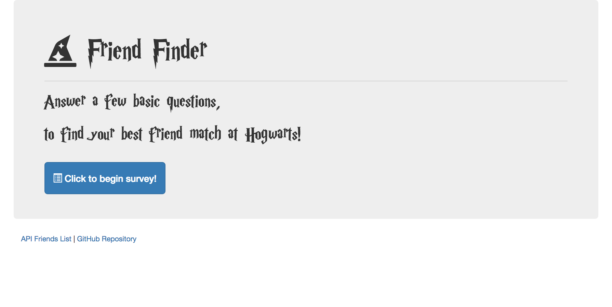
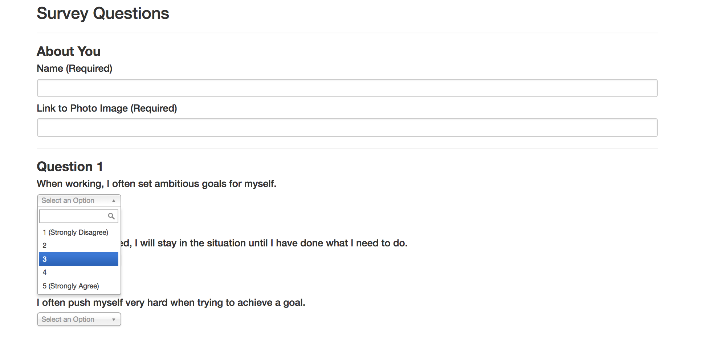

# friend-finder

## Overview

The "Friend Finder" application is similar to a dating app but with friends. This edition of Friend Finder asks the user to participate in a 10-question survey. The results of that survey will be compared to exisiting results to match the user with a friend at Hogwarts School of Witchcraft and Wizardry. Once completition of the survey, the user will be matched with a character whose name and photo will be displayed. 

## Demo

Navigate to [Demo] (https://alinav-friend-finder.herokuapp.com/) hosted on [Heroku](https://www.heroku.com/).

## Setup

```
npm install
npm install express
npm install body-parser
npm install path

```

### Home Screen



### Survey 



## Technologies Used

* HTML
* CSS 
    * Chosen CSS
* JavaScript
* JQuery
* Node JS
* NPM Packages: express, body-parser, path

